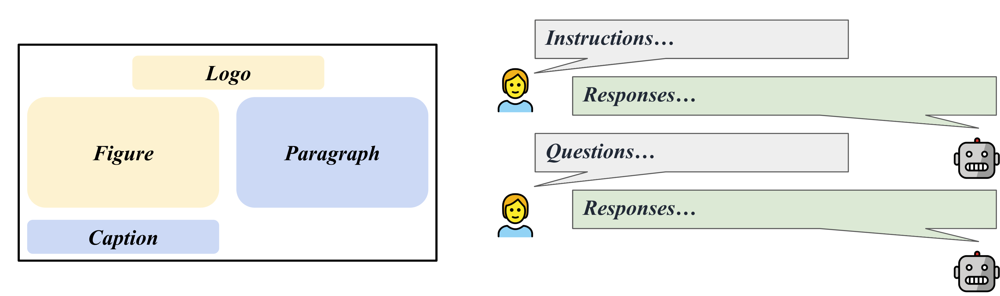

# LLaVAR

**LLaVAR: Enhanced Visual Instruction Tuning for Text-Rich Image Understanding**

*Yanzhe Zhang, Ruiyi Zhang, Jiuxiang Gu, Yufan Zhou, Nedim Lipka, Diyi Yang, Tong Sun*

[Project Page](https://llavar.github.io/)

[Arxiv Link](https://arxiv.org/abs/2306.17107)

[Demo](https://50c07d47062dc0cc5a.gradio.live)



```
@misc{zhang2023llavar,
    title={LLaVAR: Enhanced Visual Instruction Tuning for Text-Rich Image Understanding},
    author={Yanzhe Zhang and Ruiyi Zhang and Jiuxiang Gu and Yufan Zhou and Nedim Lipka and Diyi Yang and Tong Sun},
    year={2023},
    eprint={2306.17107},
    archivePrefix={arXiv},
    primaryClass={cs.CV}
}
```
[UPDATE 07/21] Release the metadata of used LAION images: [pretrain](https://huggingface.co/datasets/SALT-NLP/LLaVAR/blob/main/pretrain_meta.json)/[finetune](https://huggingface.co/datasets/SALT-NLP/LLaVAR/blob/main/finetune_meta.json).

[UPDATE 07/12] Release the OCR evaluation results/script on the [MME](https://github.com/BradyFU/Awesome-Multimodal-Large-Language-Models/tree/Evaluation) benchmark. LLaVAR increases the OCR score of LLaVA from 50 to 80.

[UPDATE 07/05] Data available on [Huggingface :hugs:](https://huggingface.co/datasets/SALT-NLP/LLaVAR).

[UPDATE 07/05] Model Weight Delta on [Huggingface :hugs:](https://huggingface.co/SALT-NLP/LLaVAR_delta/tree/main).

[UPDATE 06/29] Initial Release.

*The main difference between our code and LLaVA's code is that we modified the training/testing/serving files to support Vicuna v1.1, which uses '\</s\>' as the separator instead of '###'.*

## Environment Setup

**Please prepare the environment/merge the model weight following LLaVA.**

Model Weight Delta: [Google Drive](https://drive.google.com/drive/folders/19uEwM1VrzX_KqCzzSJAh8RqOHbf4WS5Z?usp=sharing), [Huggingface](https://huggingface.co/SALT-NLP/LLaVAR_delta/tree/main)

This should be merged with LLaMA-13B.

After merging, please add "v1" to your folder name and make sure the conversation mode "llava_v1" is used.

## Training Data ([Huggingface](https://huggingface.co/datasets/SALT-NLP/LLaVAR))

Our image data is already transformed into the format of LLaVA pretraining/finetuning (They have "fake" file names in the format of CC3M and COCO). You can download them and merge them into the LLaVA training sets.

Our instructions, on the other hand, already contain LLaVA's instructions.

Pretraining Images： [Google Drive](https://drive.google.com/file/d/1zWpqnAcaG_dUwkJJUvP9FH9zq__c-ODY/view?usp=sharing)

Pretraining Instructions (595K + 422K)： [Google Drive](https://drive.google.com/file/d/1_GCHFwrPGjp-9tZlDBwVkdz-L1ymchKY/view?usp=sharing)

Finetuning Images： [Google Drive](https://drive.google.com/file/d/1Ms7OCjcFQ18Whmujszpc9bTp0Jy0Dye4/view?usp=sharing)

Finetuning Instructions (158K + 16K): [Google Drive](https://drive.google.com/file/d/1ISdKOV1wwVkLHf5FNutctpOBa-CmNRFv/view?usp=sharing)

Finetuning Instructions (158K + 20K): [Google Drive](https://drive.google.com/file/d/1NHO8lly6pUo-fdyOAyWeGiQJWRb9qggk/view?usp=sharing)


## Evaluation Data ([Huggingface](https://huggingface.co/datasets/SALT-NLP/LLaVAR))

We collect 50 instruction-following questions and answers on 50 text-rich images from LAION, which can be leveraged for [GPT-4-based instruction-following Evaluation](https://github.com/haotian-liu/LLaVA#gpt-assisted-evaluation).

Evaluation Images： [Google Drive](https://drive.google.com/file/d/1tQQ6CX0fCH2kMuI9imrcEkYRWoVKScWX/view?usp=sharing)

GPT-4 Evaluation Contexts (595K + 422K)： [File](./files/caps_laion_50_val.jsonl)

GPT-4 Evaluation Rules： [File](./files/rule_read_v3.json)

Questions: [File](./files/qa50_questions.jsonl)

GPT-4 Answers: [File](./files/qa50_gpt4_answer.jsonl)


## Training Script

You should merge our pretraining images into the cc3m folder.


```Shell
torchrun --nnodes=1 --nproc_per_node=8 --master_port=25001 \
   /path/to/LLaVA/llava/train/train_mem.py \
    --model_name_or_path /path/to/models/vicuna_13b_v1_1 \
    --data_path /path/to/chat_llavar.json \
    --image_folder /path/to/cc3m \
    --vision_tower openai/clip-vit-large-patch14-336 \
    --tune_mm_mlp_adapter True \
    --mm_vision_select_layer -2 \
    --mm_use_im_start_end \
    --bf16 True \
    --output_dir /path/to/checkpoint \
    --num_train_epochs 1 \
    --per_device_train_batch_size 8 \
    --per_device_eval_batch_size 4 \
    --gradient_accumulation_steps 2 \
    --evaluation_strategy "no" \
    --save_strategy "steps" \
    --save_steps 4000 \
    --save_total_limit 1 \
    --learning_rate 2e-3 \
    --weight_decay 0. \
    --warmup_ratio 0.03 \
    --lr_scheduler_type "cosine" \
    --logging_steps 1 \
    --tf32 True \
    --model_max_length 1024 \
    --gradient_checkpointing True \
    --lazy_preprocess True \
    --image_aspect_ratio 'pad' \
    --report_to wandb
```

You should merge our finetuning images into the coco2017 folder.


```Shell
torchrun --nnodes=1 --nproc_per_node=8 --master_port=25001 \
    /path/to/LLaVA/llava/train/train_mem.py \
    --model_name_or_path /path/to/models/vicuna_13b_v1_1 \
    --data_path /path/to/llava_instruct_150k_llavar_16k.json \
    --image_folder /path/to/coco/images/train2017 \
    --vision_tower openai/clip-vit-large-patch14-336 \
    --pretrain_mm_mlp_adapter /path/to/mm_proj/llava-13b-pretrain.bin \
    --mm_vision_select_layer -2 \
    --mm_use_im_start_end True \
    --bf16 True \
    --output_dir /path/to/checkpoint \
    --num_train_epochs 3 \
    --per_device_train_batch_size 4 \
    --per_device_eval_batch_size 4 \
    --gradient_accumulation_steps 1 \
    --evaluation_strategy "no" \
    --save_strategy "steps" \
    --save_steps 8000 \
    --save_total_limit 1 \
    --learning_rate 2e-5 \
    --weight_decay 0. \
    --warmup_ratio 0.03 \
    --lr_scheduler_type "cosine" \
    --logging_steps 1 \
    --tf32 True \
    --fsdp "full_shard auto_wrap" \
    --fsdp_transformer_layer_cls_to_wrap 'LlamaDecoderLayer' \
    --model_max_length 2048 \
    --gradient_checkpointing True \
    --lazy_preprocess True \
    --image_aspect_ratio 'pad' \
    --report_to wandb
```

## Evaluation Script

Instruction-following on COCO images.

```
python /path/to/LLaVA/llava/eval/model_vqa.py \
    --model-name /path/to/checkpoint \
    --question-file \
    /path/to/LLaVA/playground/data/coco2014_val_qa_eval/qa90_questions.jsonl \
    --image-folder \
    /path/to/coco2014/val2014 \
    --answers-file \
    /path/to/qa90-answer-file.jsonl \
    --conv-mode "llava_v1"
```

Instruction-following on a given image URL.
```
python -m llava.eval.run_llava \
    --model-name /path/to/checkpoint \
    --image-file "https://cdn.shopify.com/s/files/1/0057/3728/3618/products/a-man-called-otto_ezrjr0pm_480x.progressive.jpg" \
    --query "Who starred in the movie?"
```

For text-based VQA (from [MultimodalOCR](https://github.com/Yuliang-Liu/MultimodalOCR)): after cloning their repo and preparing the data, you can put the `./MultimodalOCR/Eval_LLaVAR.py` in `/your/path/to/MultimodalOCR/models/LLaVA/` and add our model to `/your/path/to/MultimodalOCR/eval.py` for evaluation.


### Acknowledgement
The code base is mainly from the [LLaVA](https://github.com/haotian-liu/LLaVA) project. Our evaluation is also built on the [MultimodalOCR](https://github.com/Yuliang-Liu/MultimodalOCR) project. 

For better language decoder, you can also pay attention to the recent Vicuna model update.

```
@article{liu2023llava,
    author      = {Liu, Haotian and Li, Chunyuan and Wu, Qingyang and Lee, Yong Jae},
    title       = {Visual Instruction Tuning},
    publisher   = {arXiv:2304.08485},
    year        = {2023}
}

@misc{liu2023hidden,
    title={On the Hidden Mystery of OCR in Large Multimodal Models},
    author={Yuliang Liu and Zhang Li and Hongliang Li and Wenwen Yu and Yang Liu and Biao Yang and Mingxin Huang and Dezhi Peng and Mingyu Liu and Mingrui Chen and Chunyuan Li and Xucheng Yin and Cheng-lin Liu and Lianwen Jin and Xiang Bai},
    year={2023},
    eprint={2305.07895},
    archivePrefix={arXiv},
    primaryClass={cs.CV}
}

@misc{vicuna2023,
    title = {Vicuna: An Open-Source Chatbot Impressing GPT-4 with 90\%* ChatGPT Quality},
    url = {https://lmsys.org/blog/2023-03-30-vicuna/},
    author = {Chiang, Wei-Lin and Li, Zhuohan and Lin, Zi and Sheng, Ying and Wu, Zhanghao and Zhang, Hao and Zheng, Lianmin and Zhuang, Siyuan and Zhuang, Yonghao and Gonzalez, Joseph E. and Stoica, Ion and Xing, Eric P.},
    month = {March},
    year = {2023}
}
```
